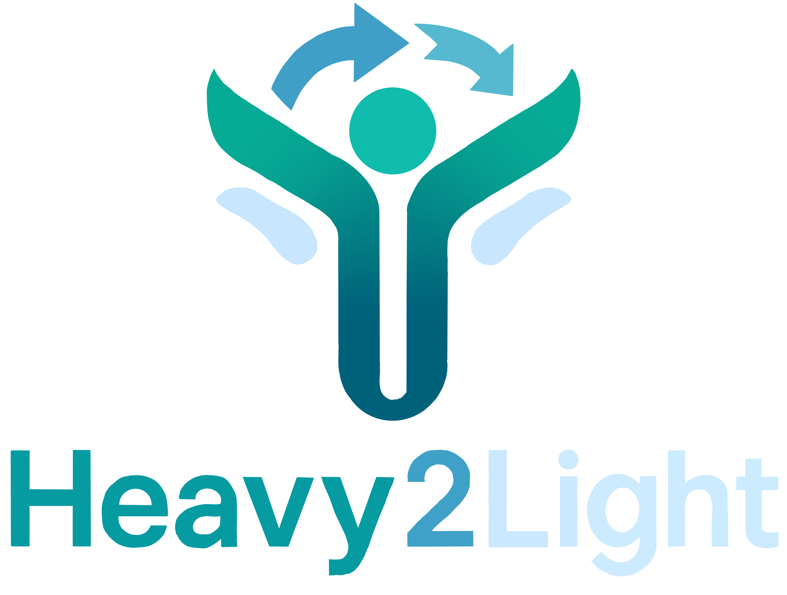

<p align="center">
  
</p>

# Heavy2Light: A Deep Learning Framework for Heavy-to-Light Antibody Sequence Translation

## Background

Antibodies are critical effector molecules of the adaptive immune system, consisting of two identical heavy chains (HCs) and two identical light chains (LCs) arranged in a characteristic Y-shaped configuration. The immense diversity of antibodies arises from precise genetic mechanisms including V(D)J recombination, junctional diversity, and somatic hypermutation. Understanding how this diversity is organized and utilized within antibody repertoires is essential for advancing fundamental immunology, rational vaccine design, and the development of engineered therapeutic antibodies.

Next-generation sequencing (NGS) has revolutionized antibody repertoire studies by enabling high-throughput characterization of immune responses at unprecedented scale. However, NGS typically loses the natural pairing information between heavy and light chains during sequencing, creating a critical knowledge gap since antibody function and specificity critically depend on the correct association of HCs and LCs.

## Problem Statement

A key challenge in computational immunology is accurately reconstructing or predicting heavy-light chain pairing relationships from sequence data alone. This is complicated by:

- **Scale and complexity**: Antibody repertoire datasets contain massive amounts of sequence data
- **Lost pairing information**: NGS loses natural HC-LC associations during sequencing
- **Functional dependency**: Antibody specificity depends on correct HC-LC pairing
- **Limited paired data**: Public databases contain billions of unpaired sequences but only millions of paired examples

## Approach

This work implements a novel two-stage deep learning strategy:

### Stage 1: Pre-training Domain-Specific Language Models
- **HeavyBERTa**: [RoBERTa](https://arxiv.org/abs/1907.11692)-based masked language model for heavy chain sequences
- **LightGPT**: [GPT-2](https://cdn.openai.com/better-language-models/language_models_are_unsupervised_multitask_learners.pdf)-based causal language model for light chain sequences
- Trained on >99 million HC and >22 million LC sequences from healthy human donors (from the [OAS](https://opig.stats.ox.ac.uk/webapps/oas/) database)

### Stage 2: Translation Model Development
- **Heavy2Light**: Encoder-decoder architecture combining our pre-trained models
- Uses parameter-efficient adapter-based fine-tuning
- Translates heavy chain sequences into corresponding light chains
- Trained on 470k paired sequences from [OAS](https://opig.stats.ox.ac.uk/webapps/oas/) and [PLAbDab](https://opig.stats.ox.ac.uk/webapps/plabdab/) databases

## Getting started
### Installation  
Environment set up to train the models with adapters using conda and [adapter_env.txt](environments/adapter_env.txt)  
```
conda create --name adapter_env --file adapter_env.txt
```
For more information on the other environments used, see [environments/README.md](environments/README.md)  

## How to use the Heavy2Light model
All models are available on [Huggingface](https://huggingface.co/leaBroe)

```python
from transformers import EncoderDecoderModel, AutoTokenizer, GenerationConfig
from adapters import init

model_path = "leaBroe/Heavy2Light"
subfolder_path = "heavy2light_final_checkpoint"

model = EncoderDecoderModel.from_pretrained(model_path)

tokenizer = AutoTokenizer.from_pretrained(model_path, subfolder=subfolder_path)

init(model)
adapter_name = model.load_adapter("leaBroe/Heavy2Light_adapter", set_active=True)
model.set_active_adapters(adapter_name)

generation_config = GenerationConfig.from_pretrained(model_path)
```
Generate one or multiple light sequences:  

```python
# example input heavy sequence
heavy_seq = "QLQVQESGPGLVKPSETLSLTCTVSGASSSIKKYYWGWIRQSPGKGLEWIGSIYSSGSTQYNPALGSRVTLSVDTSQTQFSLRLTSVTAADTATYFCARQGADCTDGSCYLNDAFDVWGRGTVVTVSS"

inputs = tokenizer(
    heavy_seq,
    padding="max_length",
    truncation=True,
    max_length=250,
    return_tensors="pt"
)

generated_seq = model.generate(
    input_ids=inputs.input_ids,
    attention_mask=inputs.attention_mask,
    num_return_sequences=1,
    output_scores=True,
    return_dict_in_generate=True,
    generation_config=generation_config,
    bad_words_ids=[[4]],
    do_sample=True,
    temperature=1.0,
)

generated_text = tokenizer.decode(
    generated_seq.sequences[0],
    skip_special_tokens=True,
)

print("Generated light sequence:", generated_text)
```
